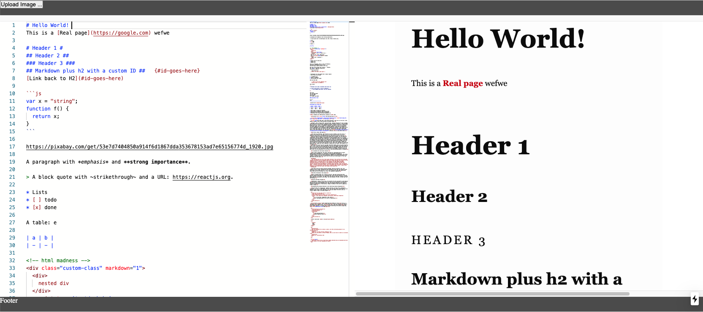

# Markdown Editor (Monaco Editor )

## Features
- VScode editor (Monaco Editor)
- Live Preview
- Scroll Sync (sync with line)
- [Markdown extension for VS Code](https://github.com/yzhang-gh/vscode-markdown)

## Preview

# Example app with Monaco Editor

This example adds support for [Monaco Editor](https://github.com/Microsoft/monaco-editor) integration using the
[`react-monaco-editor`](https://github.com/react-monaco-editor/react-monaco-editor) library.

## Ref

- Special thanks ported of Markdown extension by [traff](https://github.com/traff/monaco-markdown) to Monaco web editor.
- [Markdown extension for VS Code](https://github.com/yzhang-gh/vscode-markdown)
